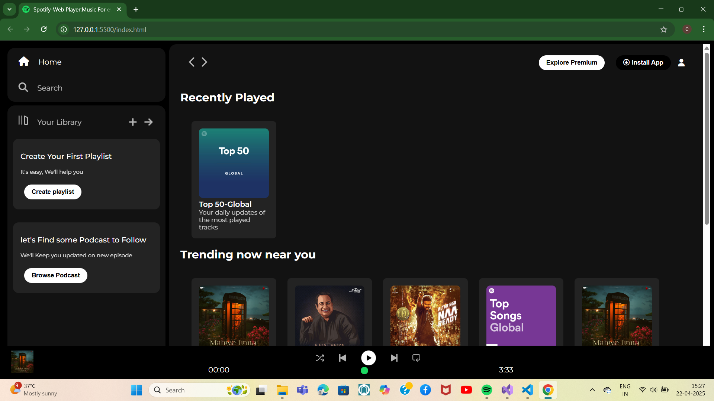

# 🎵 Spotify Clone

A simple and responsive clone of the Spotify landing page built using **HTML** and **CSS**. This project is part of my web development learning journey and focuses on layout, responsiveness, and styling.

---

## 📸 Preview

 <!-- You can add your own screenshot and rename it -->

---

## 🚀 Features

- 🎧 Clean and modern UI inspired by Spotify
- 📱 Fully responsive layout for mobile and desktop
- 🌈 Custom colors and icons using CSS
- 🎨 Organized code with semantic HTML

---

## 🛠️ Tech Stack

- **HTML5**
- **CSS3**
- [Font Awesome](https://fontawesome.com/) (for icons)

---

## 📸 Screenshot

You can add your project screenshot in the repo to showcase the layout. Save it as `screenshot.png` and it’ll show in the README preview.

---

## 🙌 Author

Made with ❤️ by [Shekhar Rao](https://github.com/SHEKHARRAO)

---

## 📄 License

This project is open-source and free to use for learning purposes.

